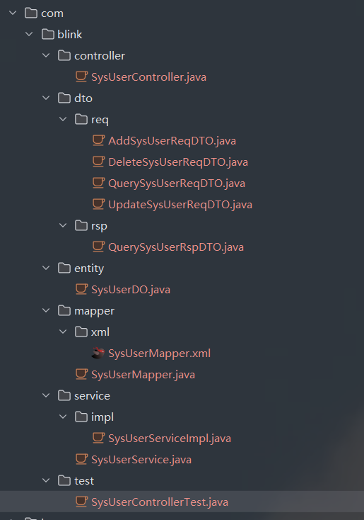

# blink微服务开发框架

该项目是作为个人工作经验的技术总结和提炼，目的提供一套可以快速开发微服务。


## 技术栈

JDK17、Spring Cloud Alibaba、Spring Boot 3、Mysql 8.0、Spring MVC、Mybatis-Plus、Redis、RabbitMQ

具体版本详情查看[build.gradle](build.gradle)

## 模块列表

通过按功能划分模块并封装打包成starter包或普通jar包,在构建服务应用时，可以按需引入，实现基础功能可插拔化。

目前项目具有以下模块

| 模块名称                       | 功能               |
|----------------------------|------------------|
| blink-datasource-starter   | mysql数据库支持       | 
| blink-framework-common     | 通用类封装            |
| blink-framework-mq         | rabbitmq支持       |
| blink-framework-openfeign  | rpc调用封装          |
| blink-framework-validation | 数据校验支持           |
| blink-redis-starter        | redis客户端支持       |
| blink-web-starter          | webApp 通用非业务功能支持 |

各个模块的具体功能详情，请查看各个模块的README文档

项目处于持续开发的状态，后续还会添加其他依赖基础包封装

## 快速构建

构建服务应用，可以参考[blink-base](blink-base)

1、 环境准备
    需要Idea、gradle、mysql、redis、nacos、nexus（可选）
    下载项目后，可以在[build.gradle](build.gradle)修改私库配置，gradle执行publish任务打包发布各模块到私库。如果没有私库，可以配置为本地仓库 打j成ar包后，手动用gradle或者maven的安装命令 安装到本地库即可

2、 Idea创建应用

    编写gradle构建脚本 引入依赖
```gradle
    implementation 'com.blink:blink-web-spring-boot-starter:1.0.0-SNAPSHOT'
    implementation 'com.blink:blink-framework-common:1.0.0-SNAPSHOT'
    implementation 'com.blink:blink-redis-spring-boot-starter:1.0.0-SNAPSHOT'
    implementation 'com.blink:blink-dataSource-spring-boot-starter:1.0.0-SNAPSHOT'
    implementation 'com.blink:blink-framework-validation:1.0.0-SNAPSHOT'
```
  参考base-app或者gateway的yml; 配置redis、nacos、mysql连接

3、生成模板代码

  使用类[CodeGenerator](blink-datasource-starter/src/main/java/com/blink/datasource/code/CodeGenerator.java)
  
```java
  public static void main(String[] args) {

        String url = "jdbc:mysql://localhost:3306/blink?useUnicode=true&characterEncoding=utf8&zeroDateTimeBehavior=convertToNull&useSSL=true&serverTimezone=GMT%2B8";
        String username = "root";
        String password = "123456";
        
        var codeGenerator = new CodeGenerator();
        codeGenerator.generateByCustomTemplate(url, username, password);

    }
```

生成成功控制台显示

```text
请输入作者名称！
blink
请输入应用包名（已有前缀com.blink）！

请输入表名，多个英文逗号分隔 生成所有表则输入all ！
sys_user
请输入要过滤的表前缀，多个英文逗号分隔 都不过滤输入none字符串！
none
请选择模板类型输入1或者2（1.DTO 2.record）
1
18:21:57.113 [main] DEBUG com.baomidou.mybatisplus.generator.AutoGenerator -- ==========================文件生成完成！！！==========================
```
默认是在生成地址是在项目根目录，随后将生成的代码拖入项目对应目录即可
生成代码效果：




4、添加启动类
 运行启动类 到此一个微服务应用构建完毕，可以进行业务开发了

```java
/**
 * 启动类
 */
@SpringBootApplication
@EnableDiscoveryClient
public class BlinkBaseAppApplication {

    public static void main(String[] args) {

       SpringApplication.run(BlinkBaseAppApplication.class, args);

    }

}
```

## 应用

目前blink框架具有两个服务应用：[blink-base](blink-base/blink-base-app/README.md)和[blink-gateway-reactive](blink-gateway-reactive/README.md)

### blink-base 

blink-base 基于RBAC的后台管理应用。具有用户、角色、权限、菜单等curd接口

### blink-gateway-reactive 

blink-gateway-reactive 是基于spring cloud gateway实现的非阻塞响应式网关。具有路由转发、动态路由、认证管理、权限校验等功能
