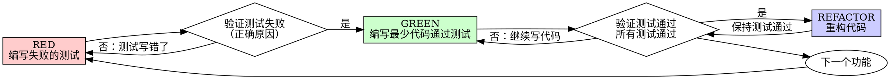

# 测试驱动开发 (TDD) 最佳实践指南

> 创建时间：2026-04-14
> 适用范围：Java 后端、前端开发

## 一、TDD 概述

### 1.1 什么是 TDD

测试驱动开发（Test-Driven Development）是一种软件开发方法，核心原则是：**先写测试，再写代码**。

### 1.2 TDD 核心原则

```
NO PRODUCTION CODE WITHOUT A FAILING TEST FIRST
（没有失败的测试，就不写生产代码）
```

### 1.3 TDD 的价值

| 方面 | 传统开发 | TDD 开发 |
|------|----------|----------|
| Bug 发现时机 | 开发完成后测试 | 开发过程中即时发现 |
| 代码质量 | 依赖后期测试 | 设计即测试，质量内建 |
| 重构信心 | 不敢改，怕改坏 | 测试保护，大胆重构 |
| 文档价值 | 代码即文档，难以理解 | 测试即活文档，一目了然 |
| 开发速度 | 前快后慢（调试耗时） | 前慢后快（调试少） |

---

## 二、Red-Green-Refactor 循环

### 2.1 循环流程图



### 2.2 三阶段详解

#### RED - 编写失败的测试

**目标**：编写一个最小测试，描述期望的行为。

**要点**：
- 一个测试只测一个行为
- 测试名称清晰描述行为
- 使用真实的业务代码，避免过度 mock

```java
// Good: 清晰描述期望行为
@Test
@DisplayName("重试失败操作3次后返回成功")
void shouldRetryFailedOperationsThreeTimes() {
    // Given: 模拟前2次失败，第3次成功
    int[] attempts = {0};
    Runnable operation = () -> {
        attempts[0]++;
        if (attempts[0] < 3) {
            throw new RuntimeException("fail");
        }
    };
    
    // When: 执行重试
    retryExecutor.executeWithRetry(operation, 3);
    
    // Then: 验证执行了3次
    assertThat(attempts[0]).isEqualTo(3);
}

// Bad: 测试名称模糊，测试 mock 而非行为
@Test
void testRetry() {
    Runnable mock = mock(Runnable.class);
    doThrow(new RuntimeException()).doThrow(new RuntimeException())
       .doNothing().when(mock).run();
    retryExecutor.executeWithRetry(mock, 3);
    verify(mock, times(3)).run();
}
```

**验证 RED 阶段**：
```bash
# 运行测试，确认失败
./gradlew test --tests "RetryExecutorTest.shouldRetryFailedOperationsThreeTimes"

# 预期输出：测试失败，原因是要测试的功能还未实现
# 如果测试通过了，说明测试写错了或者功能已经存在
```

#### GREEN - 编写最少代码

**目标**：编写最简单的代码使测试通过，不要过度设计。

```java
// Good: 最简单实现
public void executeWithRetry(Runnable operation, int maxRetries) {
    for (int i = 0; i < maxRetries; i++) {
        try {
            operation.run();
            return;
        } catch (Exception e) {
            if (i == maxRetries - 1) {
                throw e;
            }
        }
    }
}

// Bad: 过度设计，添加了测试不需要的功能
public void executeWithRetry(Runnable operation, int maxRetries, 
                             RetryConfig config, Consumer<Exception> errorHandler) {
    // YAGNI (You Ain't Gonna Need It) - 不需要的功能
}
```

**验证 GREEN 阶段**：
```bash
# 运行测试，确认通过
./gradlew test --tests "RetryExecutorTest"

# 确认所有测试通过，不只是新写的测试
./gradlew test
```

#### REFACTOR - 重构代码

**目标**：在测试保护下，优化代码结构，保持测试通过。

```java
// 重构前：简单的 for 循环
public void executeWithRetry(Runnable operation, int maxRetries) {
    for (int i = 0; i < maxRetries; i++) {
        try {
            operation.run();
            return;
        } catch (Exception e) {
            if (i == maxRetries - 1) {
                throw e;
            }
        }
    }
}

// 重构后：提取方法，增加可读性
public void executeWithRetry(Runnable operation, int maxRetries) {
    int attempt = 0;
    while (true) {
        try {
            operation.run();
            return;
        } catch (Exception e) {
            if (++attempt >= maxRetries) {
                throw e;
            }
        }
    }
}
```

---

## 三、完整示例：网关监控指标上报

以下示例展示了本次项目中 TDD 的实际应用。

### 3.1 需求描述

实现网关实例的指标上报功能：
- 采集 JVM 内存、CPU、GC、线程等指标
- 异步推送到 Redis Stream
- 支持实例启动注册和关闭注销

### 3.2 RED 阶段：编写测试

```java
class MetricsReporterImplTest {

    @Nested
    @DisplayName("指标采集测试")
    class CollectMetricsTests {

        @Test
        @DisplayName("应该正确采集堆内存指标")
        void shouldCollectHeapMetrics() {
            // Given: 创建服务实例
            MetricsReporterImpl reporter = new MetricsReporterImpl(
                meterRegistry, reactiveStreamOperations, instanceId, streamKey
            );

            // When: 执行采集
            MetricsMessage message = reporter.collectMetrics();

            // Then: 验证堆内存指标
            assertThat(message.getHeapUsed()).isPositive();
            assertThat(message.getHeapMax()).isPositive();
            assertThat(message.getHeapUsagePercent()).isBetween(0.0, 100.0);
        }

        @Test
        @DisplayName("应该正确采集 GC 指标 - G1 收集器")
        void shouldCollectGcMetricsForG1Collector() {
            // Given
            MetricsReporterImpl reporter = createReporter();

            // When
            MetricsMessage message = reporter.collectMetrics();

            // Then: 验证 GC 指标（G1 收集器）
            assertThat(message.getYoungGcCount()).isNotNull();
            assertThat(message.getYoungGcTime()).isNotNull();
            assertThat(message.getOldGcCount()).isNotNull();
            assertThat(message.getOldGcTime()).isNotNull();
        }
    }

    @Nested
    @DisplayName("Redis Stream 推送测试")
    class PushToStreamTests {

        @Test
        @DisplayName("异步推送失败时不应抛出异常")
        void shouldNotThrowExceptionOnAsyncPushFailure() {
            // Given: 模拟 Redis 推送失败
            when(reactiveStreamOperations.add(anyString(), anyMap()))
                .thenReturn(Mono.error(new RuntimeException("Redis error")));

            MetricsReporterImpl reporter = createReporter();

            // When & Then: 不应抛出异常
            assertThatCode(() -> reporter.reportMetricsAsync(message))
                .doesNotThrowAnyException();
        }
    }
}
```

### 3.3 GREEN 阶段：编写实现

```java
@Service
public class MetricsReporterImpl implements MetricsReporter {

    @Override
    public MetricsMessage collectMetrics() {
        MetricsMessage message = new MetricsMessage();
        message.setInstanceId(instanceId);
        message.setServiceId(serviceId);
        message.setTimestamp(System.currentTimeMillis());
        message.setType("METRICS");

        // 采集堆内存
        Gauge heapUsed = meterRegistry.find("jvm.memory.used")
            .tag("area", "heap").gauge();
        if (heapUsed != null) {
            message.setHeapUsed(heapUsed.value());
        }

        // 采集 GC 指标
        collectGcMetrics(message);

        return message;
    }

    @Async("ioIntensiveThreadPool")
    @Override
    public void reportMetricsAsync(MetricsMessage message) {
        try {
            Map<String, String> messageMap = convertToMap(message);
            reactiveStreamOperations.add(streamKey, messageMap).block();
        } catch (Exception e) {
            log.error("[MetricsReporter] 异步推送失败", e);
            // 不抛出异常，避免影响主线程
        }
    }
}
```

### 3.4 REFACTOR 阶段：优化代码

```java
// 重构：提取私有方法，增加可读性
private void collectGcMetrics(MetricsMessage message) {
    meterRegistry.getMeters().stream()
        .filter(meter -> meter.getId().getName().startsWith("jvm.gc."))
        .forEach(meter -> {
            String gcName = extractGcName(meter);
            String metricType = extractMetricType(meter);
            updateGcMetric(message, gcName, metricType, meter);
        });
}

// 重构：使用 Builder 模式创建消息
public static class Builder {
    public MetricsMessage build() {
        MetricsMessage message = new MetricsMessage();
        message.setInstanceId(instanceId);
        message.setTimestamp(System.currentTimeMillis());
        // ...
        return message;
    }
}
```

---

## 四、测试金字塔与测试策略

### 4.1 测试金字塔

```
                    △
                   /E2E\          端到端测试（少量）
                  /─────\         - 启动慢，维护成本高
                 /  集成  \        - 验证组件协作
                /─────────\       
               /   单元测试  \      单元测试（大量）
              /─────────────\     - 快速，隔离
             /                \   - 验证单个行为
```

### 4.2 单元测试 vs 集成测试

| 特性 | 单元测试 | 集成测试 |
|------|----------|----------|
| 范围 | 单个类/方法 | 多个组件协作 |
| 依赖 | Mock 隔离 | 真实依赖 |
| 速度 | 毫秒级 | 秒级 |
| 数量 | 大量 | 适量 |
| 定位问题 | 精确定位 | 范围较大 |

### 4.3 Mock 使用原则

```java
// Good: 只 Mock 外部依赖（数据库、网络）
@ExtendWith(MockitoExtension.class)
class UserServiceTest {
    @Mock
    private UserRepository userRepository;  // 外部依赖
    
    @InjectMocks
    private UserServiceImpl userService;    // 被测对象
    
    @Test
    void shouldReturnUserWhenExists() {
        when(userRepository.findById(1L)).thenReturn(Optional.of(user));
        
        User result = userService.getUser(1L);
        
        assertThat(result).isNotNull();
    }
}

// Bad: Mock 被测对象本身
@Test
void testUserService() {
    UserService mockService = mock(UserService.class);  // 错误！
    when(mockService.getUser(1L)).thenReturn(user);
    // 这测试的是 mock，不是真实代码
}
```

---

## 五、常见问题与解决方案

### 5.1 测试先行 vs 测试后补

| 场景 | 测试后补 | TDD 先行 |
|------|----------|----------|
| 信心来源 | "我记得测过了" | 测试证明代码正确 |
| 边界情况 | 容易遗漏 | 测试驱动发现 |
| 重构风险 | 不敢改 | 测试保护 |
| 文档价值 | 无 | 测试即文档 |

**正确做法**：即使代码已写好，也要先写测试验证理解，再重构代码。

### 5.2 测试私有方法

```java
// 问题：私有方法难以直接测试
private void processData(Data data) { ... }

// 方案1：通过公共方法间接测试（推荐）
@Test
void shouldProcessDataWhenSubmit() {
    // 测试公共方法，间接验证私有方法行为
    service.submit(validData);
    assertThat(result).isCorrect();
}

// 方案2：使用反射（不推荐，仅用于特殊情况）
@Test
void shouldProcessDataCorrectly() throws Exception {
    Method method = Service.class.getDeclaredMethod("processData", Data.class);
    method.setAccessible(true);
    method.invoke(service, testData);
}
```

### 5.3 测试异步代码

```java
// 使用 Awaitility 测试异步操作
@Test
void shouldCompleteAsyncOperation() {
    // Given
    AsyncProcessor processor = new AsyncProcessor();
    
    // When
    processor.processAsync(data);
    
    // Then: 等待异步完成
    await().atMost(5, SECONDS)
           .until(() -> processor.isCompleted());
    assertThat(processor.getResult()).isNotNull();
}

// 使用 CompletableFuture 测试
@Test
void shouldReturnResultFromAsyncOperation() {
    CompletableFuture<Result> future = processor.processAsync(data);
    
    Result result = future.get(5, SECONDS);  // 阻塞等待
    
    assertThat(result).isNotNull();
}
```

### 5.4 测试覆盖率的误区

```
误区：追求 100% 覆盖率
真相：覆盖率是手段，不是目标

关键：
- 覆盖关键业务逻辑
- 覆盖边界条件
- 覆盖异常路径
- 不为覆盖率而写测试
```

---

## 六、TDD 开发检查清单

### 6.1 每个测试编写前

- [ ] 明确要测试的行为（一个行为一个测试）
- [ ] 确定测试名称能描述期望行为
- [ ] 准备测试数据（Given）
- [ ] 确定执行动作（When）
- [ ] 确定验证断言（Then）

### 6.2 RED 阶段验证

- [ ] 运行测试，确认失败
- [ ] 失败原因是功能未实现（不是语法错误）
- [ ] 错误信息能帮助定位问题

### 6.3 GREEN 阶段验证

- [ ] 编写最少代码通过测试
- [ ] 运行测试，确认通过
- [ ] 运行所有测试，确认没有破坏其他功能
- [ ] 输出干净（无错误、警告）

### 6.4 REFACTOR 阶段验证

- [ ] 重构后运行测试，确认仍然通过
- [ ] 代码更清晰、更易读
- [ ] 没有添加新功能

### 6.5 完成标准

- [ ] 每个公共方法都有测试
- [ ] 边界条件已覆盖
- [ ] 异常路径已覆盖
- [ ] 测试名称清晰描述行为
- [ ] 测试使用真实代码（最小化 mock）
- [ ] 所有测试通过

---

## 七、工具与配置

### 7.1 Java 后端测试框架

```gradle
// build.gradle
dependencies {
    // JUnit 5
    testImplementation 'org.junit.jupiter:junit-jupiter'
    
    // Mockito
    testImplementation 'org.mockito:mockito-core'
    testImplementation 'org.mockito:mockito-junit-jupiter'
    
    // AssertJ（流式断言）
    testImplementation 'org.assertj:assertj-core'
    
    // Awaitility（异步测试）
    testImplementation 'org.awaitility:awaitility'
    
    // Spring Boot Test
    testImplementation 'org.springframework.boot:spring-boot-starter-test'
}
```

### 7.2 前端测试框架

```json
// package.json
{
  "devDependencies": {
    "vitest": "^1.0.0",
    "@vue/test-utils": "^2.4.0",
    "@testing-library/vue": "^8.0.0",
    "happy-dom": "^12.0.0"
  }
}
```

### 7.3 测试命名约定

| 类型 | 命名模式 | 示例 |
|------|----------|------|
| 单元测试 | `{Class}Test` | `UserServiceTest` |
| 集成测试 | `{Class}IT` | `UserControllerIT` |
| 测试方法 | `should{ExpectedBehavior}When{Condition}` | `shouldReturnUserWhenExists` |
| 显示名称 | `@DisplayName("应该...当...")` | `@DisplayName("用户存在时应该返回用户")` |

---

## 八、参考资料

- [Test-Driven Development: By Example](https://book.douban.com/subject/1230036/) - Kent Beck
- [Clean Code](https://book.douban.com/subject/4199741/) - Robert C. Martin
- [JUnit 5 User Guide](https://junit.org/junit5/docs/current/user-guide/)
- [Mockito Documentation](https://javadoc.io/doc/org.mockito/mockito-core/latest/org/mockito/Mockito.html)
- [AssertJ Documentation](https://assertj.github.io/doc/)

---

## 九、相关文档

- [单元测试规范](../unit-test-guidelines.md)
- [软件测试生命周期指南](./best-practices/software-testing-lifecycle-guide.md)
