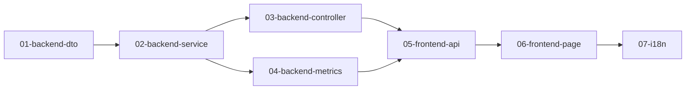

# 实例管理功能实现计划索引

> **For agentic workers:** REQUIRED SUB-SKILL: Use superpowers:subagent-driven-development or superpowers:executing-plans to implement this plan task-by-task.

**设计文档:** `docs/superpowers/specs/2026-04-11-instance-management-design.md`

## 任务拆分

本计划按模块拆分为以下子计划文件，按顺序执行：

| 序号 | 计划文件 | 内容 | 预估时间 |
|------|----------|------|----------|
| 1 | `01-backend-dto.md` | 后端 DTO 和常量定义 | 30min |
| 2 | `02-backend-service.md` | GatewayInstanceService 扩展 | 45min |
| 3 | `03-backend-controller.md` | GatewayInstanceController 新增接口 | 20min |
| 4 | `04-backend-metrics.md` | MetricsCollectorService 扩展（GC/线程指标） | 40min |
| 5 | `05-frontend-api.md` | 前端 API 模块和类型定义 | 25min |
| 6 | `06-frontend-page.md` | 前端实例管理页面 | 60min |
| 7 | `07-i18n.md` | 国际化配置 | 15min |

## 执行顺序



## 文件结构概览

### 后端新增/修改文件

```
blink-gateway/gateway-admin/src/main/java/com/blink/gateway/admin/
├── constants/
│   ├── ErrCodeConstant.java          (修改: 新增错误码)
│   └── RouteConstant.java            (新增: 实例状态常量)
├── dto/
│   ├── req/
│   │   ├── QueryInstanceReq.java     (新增: 分页查询请求)
│   │   ├── SaveInstanceReq.java      (新增: 保存实例请求)
│   │   ├── DeleteInstanceReq.java    (新增: 删除实例请求)
│   │   └── GetInstanceDetailReq.java (新增: 获取详情请求)
│   ├── rsp/
│   │   ├── QueryInstanceListRsp.java (新增: 实例列表响应)
│   │   └── InstanceDetailRsp.java    (新增: 实例详情响应)
│   └── vo/
│   │   ├── JvmMetricsVO.java         (新增: JVM指标VO)
│   │   ├── HealthDetailVO.java       (新增: 健康详情VO)
│   │   ├── HttpMetricsVO.java        (新增: HTTP指标VO)
│   │   └── ComponentHealthVO.java    (新增: 组件健康VO)
│       InstanceInfoVO.java           (新增: 实例基本信息VO)
├── service/
│   ├── GatewayInstanceService.java   (修改: 新增方法)
│   └── impl/
│       └── GatewayInstanceServiceImpl.java (修改: 实现新方法)
│       MetricsCollectorServiceImpl.java    (修改: 扩展指标采集)
├── controller/
│   └── GatewayInstanceController.java (修改: 新增接口)
```

### 前端新增/修改文件

```
frontend/packages/gateway-admin/src/
├── api/
│   └── instance.ts                   (新增: 实例API)
├── views/
│   └── instance/
│       └── index.vue                 (新增: 实例管理页面)
├── router/
│   └── index.ts                      (修改: 新增路由)
├── locales/
│   ├── zh-cn.ts                      (修改: 新增国际化)
│   └── en-us.ts                      (修改: 新增国际化)
```

## 开始执行

请按顺序读取并执行各子计划文件。