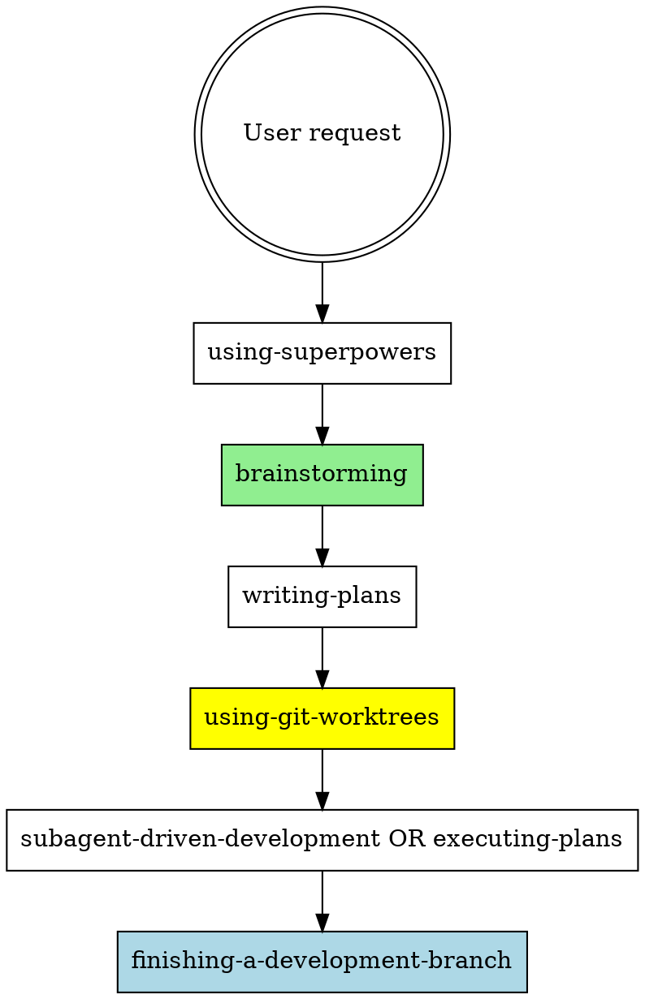

# Superpowers 执行计划规范文档

**日期:** 2026-04-06
**版本:** 5.0.7
**状态:** 参考

---

## 一、概述

Superpowers 是一套系统化的开发工作流技能集，用于指导 AI 助手从想法到实现再到交付的完整过程。核心原则：**先设计后实现，先测试后编码，先验证后声明**。

### 核心工作流

```
想法 → Brainstorming → Design Doc → Writing Plans → Execution → Finishing
```

---

## 二、技能层级关系

### 2.1 流程技能（决定如何执行）

| 技能名称 | 用途 | 触发时机 |
|---------|------|---------|
| `using-superpowers` | 技能入口，建立使用规则 | 对话开始时 |
| `brainstorming` | 探索需求，形成设计 | 任何创意工作前 |
| `writing-plans` | 编写实现计划 | 设计完成后 |
| `executing-plans` | 执行计划（独立会话） | 有计划需执行时 |
| `subagent-driven-development` | 子代理驱动执行（同会话） | 有计划需执行时 |
| `finishing-a-development-branch` | 完成开发分支 | 实现完成后 |

### 2.2 保障技能（确保质量）

| 技能名称 | 用途 | 触发时机 |
|---------|------|---------|
| `test-driven-development` | TDD 工作流 | 编写任何代码前 |
| `verification-before-completion` | 完成前验证 | 声明完成前 |
| `systematic-debugging` | 系统化调试 | 遇到 bug 时 |
| `requesting-code-review` | 请求代码审查 | 完成任务后 |
| `receiving-code-review` | 接收代码审查 | 收到审查反馈时 |

### 2.3 支撑技能

| 技能名称 | 用途 | 触发时机 |
|---------|------|---------|
| `using-git-worktrees` | Git Worktree 管理 | 开始功能开发前 |

---

## 三、Brainstorming 规范

### 3.1 核心原则

**硬性规则：** 在展示设计并获得用户批准前，**禁止**调用任何实现技能、编写任何代码、创建任何项目结构。

### 3.2 Checklist（必须按序执行）

1. **探索项目上下文** — 检查文件、文档、最近提交
2. **提供 Visual Companion（可选）** — 如涉及视觉问题，单独消息询问
3. **提问澄清问题** — 一次一个问题，理解目的/约束/成功标准
4. **提出 2-3 个方案** — 包含权衡和推荐
5. **展示设计** — 按复杂度分段展示，每段后获取批准
6. **编写设计文档** — 保存到 `docs/superpowers/specs/YYYY-MM-DD-<topic>-design.md`
7. **Spec 自检** — 检查占位符、矛盾、歧义、范围
8. **用户审查 Spec** — 请求用户审查设计文档
9. **转入实现** — 调用 `writing-plans` 技能

### 3.3 文档格式

设计文档必须包含：
- 概述（功能描述）
- 功能列表
- 用户界面（ASCII 模型或描述）
- 组件结构
- 数据模型
- 验收标准

---

## 四、Writing Plans 规范

### 4.1 核心原则

- 假设执行者对代码库零上下文
- 记录所有必要信息：文件路径、代码、测试方法
- 任务粒度：每个步骤是一个动作（2-5 分钟）
- DRY、YAGNI、TDD、频繁提交

### 4.2 计划文档头部（必须）

```markdown
# [功能名称] Implementation Plan

> **For agentic workers:** REQUIRED SUB-SKILL: Use superpowers:subagent-driven-development (recommended) or superpowers:executing-plans to implement this plan task-by-task. Steps use checkbox (`- [ ]`) syntax for tracking.

**Goal:** [一句话描述目标]

**Architecture:** [2-3 句架构描述]

**Tech Stack:** [关键技术/库]

---
```

### 4.3 任务结构

```markdown
### Task N: [组件名称]

**Files:**
- Create: `exact/path/to/file.py`
- Modify: `exact/path/to/existing.py:123-145`
- Test: `tests/exact/path/to/test.py`

- [ ] **Step 1: Write the failing test**

[完整测试代码]

- [ ] **Step 2: Run test to verify it fails**

Run: `pytest tests/path/test.py::test_name -v`
Expected: FAIL with "function not defined"

- [ ] **Step 3: Write minimal implementation**

[完整实现代码]

- [ ] **Step 4: Run test to verify it passes**

Run: `pytest tests/path/test.py::test_name -v`
Expected: PASS

- [ ] **Step 5: Commit**

```bash
git add tests/path/test.py src/path/file.py
git commit -m "feat: add specific feature"
```
```

### 4.4 禁止的占位符模式

以下内容是**计划失败**，永远不要写：
- "TBD", "TODO", "implement later", "fill in details"
- "Add appropriate error handling" / "add validation"
- "Write tests for the above"（无实际测试代码）
- "Similar to Task N"（必须重复代码）
- 描述做什么但不展示如何做
- 引用未在任何任务中定义的类型/函数/方法

### 4.5 自检清单

完成计划后检查：
1. **Spec 覆盖**：每个需求是否有对应任务？
2. **占位符扫描**：搜索禁止模式，修复
3. **类型一致性**：后续任务使用的类型/方法名是否与早期任务匹配？

---

## 五、Executing Plans 规范

### 5.1 执行流程

```
Step 1: Load and Review Plan → Step 2: Execute Tasks → Step 3: Complete Development
```

### 5.2 Step 1: 加载和审查计划

1. 读取计划文件
2. 批判性审查 - 识别问题或疑虑
3. 如有问题：向用户提出后再开始
4. 无问题：创建 TodoWrite 并继续

### 5.3 Step 2: 执行任务

每个任务：
1. 标记为 `in_progress`
2. 精确执行每个步骤（计划已拆解为小步骤）
3. 运行指定的验证
4. 标记为 `completed`

### 5.4 Step 3: 完成开发

所有任务完成后：
- 调用 `superpowers:finishing-a-development-branch`
- 验证测试，提供选项，执行选择

### 5.5 停止并求助的时机

**立即停止执行：**
- 遇到阻塞（缺失依赖、测试失败、指令不清）
- 计划有关键缺口无法开始
- 不理解指令
- 验证反复失败

**请求澄清，不要猜测。**

---

## 六、Subagent-Driven Development 规范

### 6.1 核心原则

每个任务：**新子代理 + 两阶段审查**（先规范合规，后代码质量）

### 6.2 流程图

```
读取计划 → 提取所有任务 → 创建 TodoWrite
  ↓
[Per Task Loop]
  ↓
派发实现子代理 → 子代理提问? → 提供上下文 → 重新派发
  ↓                    ↓ (否)
子代理实现、测试、提交、自检
  ↓
派发规范审查子代理 → 符合规范? → 不符合 → 实现子代理修复 → 重新审查
  ↓                    ↓ (是)
派发代码质量审查子代理 → 通过? → 不通过 → 实现子代理修复 → 重新审查
  ↓                    ↓ (是)
标记任务完成 → 更多任务? → 是 → 返回循环
  ↓                    ↓ (否)
派发最终代码审查子代理 → finishing-a-development-branch
```

### 6.3 模型选择策略

| 任务类型 | 模型选择 |
|---------|---------|
| 机械实现（1-2 文件，完整 spec） | 快速/便宜模型 |
| 集成和判断（多文件协调） | 标准模型 |
| 架构/设计/审查 | 最强模型 |

### 6.4 子代理状态处理

| 状态 | 处理方式 |
|------|---------|
| `DONE` | 进入规范合规审查 |
| `DONE_WITH_CONCERNS` | 先读疑虑，再决定是否继续审查 |
| `NEEDS_CONTEXT` | 提供缺失上下文，重新派发 |
| `BLOCKED` | 评估阻塞原因：提供上下文/升级模型/分解任务/升级用户 |

### 6.5 禁止行为

- 在 main/master 分支开始实现（除非用户明确同意）
- 跳过审查（规范合规或代码质量）
- 在审查有问题时继续推进
- 并行派发多个实现子代理（会冲突）
- 让子代理读取计划文件（直接提供完整文本）
- 让实现子代理的自检替代正式审查
- **先做代码质量审查再做规范合规审查**（顺序错误）
- 在任一审查有问题时进入下一个任务

---

## 七、Test-Driven Development 规范

### 7.1 铁律

```
NO PRODUCTION CODE WITHOUT A FAILING TEST FIRST
```

先写代码后写测试？删除。重来。

### 7.2 Red-Green-Refactor 循环

```
RED → Write failing test → Verify RED → GREEN → Minimal code → Verify GREEN → REFACTOR → Clean up → Repeat
```

### 7.3 验证要求

| 阶段 | 必须验证 |
|------|---------|
| RED | 测试失败（不是错误），失败原因正确 |
| GREEN | 测试通过，其他测试仍通过，输出干净 |
| REFACTOR | 保持 GREEN |

### 7.4 常见借口及反驳

| 借口 | 真相 |
|------|------|
| "太简单不需要测试" | 简单代码也会出错，测试只需 30 秒 |
| "测试后写一样" | 测试后写 = "这做了什么？"，测试先写 = "这应该做什么？" |
| "已手动测试" | 手动测试无记录、不可重跑 |
| "删掉 X 小时的工作浪费" | 沉没成本谬误，保留未验证代码才是技术债务 |
| "TDD 是教条" | TDD 是实用主义：提交前发现 bug，比事后调试快 |

---

## 八、Verification Before Completion 规范

### 8.1 铁律

```
NO COMPLETION CLAIMS WITHOUT FRESH VERIFICATION EVIDENCE
```

在声明前必须运行验证命令并确认输出。

### 8.2 门控函数

```
BEFORE claiming any status:
1. IDENTIFY: 什么命令证明这个声明？
2. RUN: 执行完整命令
3. READ: 全部输出，检查退出码，计数失败
4. VERIFY: 输出确认声明吗？
   - 否：声明实际状态带证据
   - 是：声明带证据
5. ONLY THEN: 声明
```

### 8.3 常见失败模式

| 声明 | 需要 | 不充分 |
|------|------|--------|
| "测试通过" | 测试命令输出：0 failures | 之前运行、"应该通过" |
| "构建成功" | 构建命令：exit 0 | Linter 通过、日志看起来好 |
| "Bug 已修复" | 测试原始症状：通过 | 代码改变、假定已修复 |
| "需求满足" |逐行检查清单 | 测试通过 |

### 8.4 红旗警告（停止）

- 使用 "should", "probably", "seems to"
- 验证前表达满意（"Great!", "Perfect!", "Done!"）
- 提交/推送/PR 前无验证
- 相信子代理成功报告
- 依赖部分验证
- 累了想结束工作

---

## 九、Finishing a Development Branch 规范

### 9.1 流程

```
Verify Tests → Determine Base Branch → Present Options → Execute Choice → Cleanup
```

### 9.2 四选项模板

```
Implementation complete. What would you like to do?

1. Merge back to <base-branch> locally
2. Push and create a Pull Request
3. Keep the branch as-is (I'll handle it later)
4. Discard this work

Which option?
```

### 9.3 选项执行

| 选项 | 合并 | 推送 | 保留 Worktree | 清理分支 |
|------|------|------|---------------|---------|
| 1. 本地合并 | ✓ | - | - | ✓ |
| 2. 创建 PR | - | ✓ | ✓ | - |
| 3. 保持现状 | - | - | ✓ | - |
| 4. 丢弃 | - | - | - | ✓ (force) |

### 9.4 Worktree 清理规则

- 选项 1、4：清理 Worktree
- 选项 2、3：保留 Worktree

---

## 十、Using Git Worktrees 规范

### 10.1 目录选择优先级

1. 检查现有目录：`.worktrees` > `worktrees`
2. 检查 CLAUDE.md 配置
3. 询问用户

### 10.2 安全验证

**项目本地目录必须验证被忽略：**

```bash
git check-ignore -q .worktrees
```

未忽略时：添加到 .gitignore → 提交 → 继续创建

### 10.3 创建步骤

1. 检测项目名称
2. 创建 Worktree 和分支
3. 运行项目设置（npm install 等）
4. 验证干净基线（运行测试）
5. 报告位置

---

## 十一、文档保存路径

| 文档类型 | 路径 |
|---------|------|
| 设计文档（Spec） | `docs/superpowers/specs/YYYY-MM-DD-<topic>-design.md` |
| 实现计划（Plan） | `docs/superpowers/plans/YYYY-MM-DD-<feature-name>.md` |

---

## 十二、关键原则总结

1. **先设计后实现**：Brainstorming → Design Doc → Plan → Execute
2. **先测试后编码**：TDD Red-Green-Refactor
3. **先验证后声明**：Verification Before Completion
4. **隔离工作空间**：Git Worktrees before starting
5. **两阶段审查**：Spec compliance → Code quality
6. **禁止占位符**：每步必须有完整内容
7. **停止不猜测**：阻塞时请求澄清
8. **禁止在 main/master 开始实现**：必须用户明确同意

---

## 十三、技能调用顺序



---

## 参考

- Superpowers 版本: 5.0.7
- 来源目录: `C:\Users\binblink\.claude\plugins\cache\claude-plugins-official\superpowers\5.0.7\skills\`