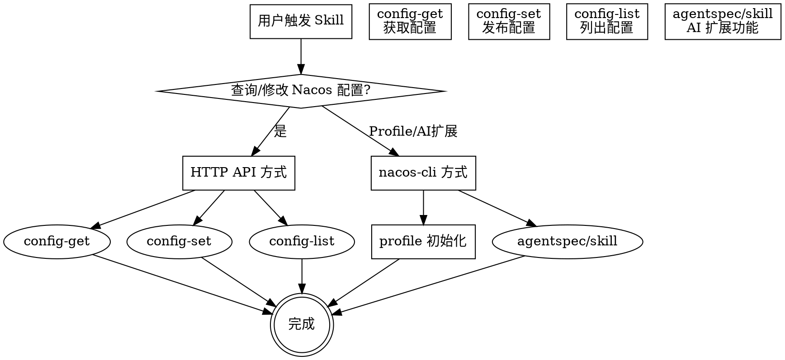

# Nacos Config Manager Skill Design

## Overview

创建一个 skill 用于通过 HTTP API 和 nacos-cli 管理 Nacos 配置。

**核心原则：**
- HTTP API 为主要方式（配置管理核心，更稳定）
- nacos-cli 为补充方式（Profile 初始化 + AI 扩展功能）

## 功能范围

| 功能 | 方式 | 原因 |
|------|------|------|
| 配置获取 | HTTP API | 稳定，无依赖问题 |
| 配置发布 | HTTP API | 直接，便于调试 |
| 配置列表 | HTTP API | 灵活过滤 |
| 配置删除 | HTTP API | 简单可靠 |
| Profile 初始化 | nacos-cli | 本地配置管理 |
| agentspec 管理 | nacos-cli | API 不支持 |
| skill 管理 | nacos-cli | API 不支持 |

## Skill 元信息

```yaml
---
name: nacos-config-manager
description: Use when managing Nacos configurations via nacos-cli - includes profile setup, config get/set/list operations, and environment switching
---
```

## 核心流程



## HTTP API 命令设计

### 配置获取 (config-get)

```bash
curl "http://${host}:${port}/nacos/v1/cs/configs?dataId=${dataId}&group=${group}&tenant=${namespace}"
```

| 参数 | 说明 | 示例 |
|------|------|------|
| host | Nacos 地址 | `127.0.0.1` |
| port | 端口 | `8848` |
| dataId | 配置文件名 | `gateway-admin.yaml` |
| group | 分组 | `DEFAULT_GROUP` |
| tenant | 命名空间 ID | `94984ad7-...`，空值表示 public |

### 配置发布 (config-set)

```bash
# 从文件发布
curl -X POST "http://${host}:${port}/nacos/v1/cs/configs" \
  -d "dataId=${dataId}" \
  -d "group=${group}" \
  -d "tenant=${namespace}" \
  --data-urlencode "content@${file}"

# 从字符串发布
curl -X POST "http://${host}:${port}/nacos/v1/cs/configs" \
  -d "dataId=${dataId}" \
  -d "group=${group}" \
  -d "tenant=${namespace}" \
  --data-urlencode "content=${yamlContent}"
```

### 配置列表 (config-list)

```bash
# 精确查询
curl "http://${host}:${port}/nacos/v1/cs/configs?search=accurate&pageNo=1&pageSize=100&dataId=${dataId}&group=${group}&tenant=${namespace}"

# 模糊查询（支持通配符 *）
curl "http://${host}:${port}/nacos/v1/cs/configs?search=blur&pageNo=1&pageSize=100&dataId=*&group=DEFAULT_GROUP&tenant=${namespace}"
```

### 配置删除 (config-delete)

```bash
curl -X DELETE "http://${host}:${port}/nacos/v1/cs/configs?dataId=${dataId}&group=${group}&tenant=${namespace}"
```

## nacos-cli 命令设计

### Profile 初始化

```bash
# 创建/编辑 profile 配置文件
nacos-cli profile edit

# 配置文件内容 (~/.nacos-cli/default.conf)
host=127.0.0.1
port=8848
namespace=94984ad7-b510-4ca4-bdcb-b6cdbd437dfb
# username=nacos      # 如需认证
# password=nacos
```

### 配置管理（备用方式）

```bash
# 获取配置
nacos-cli config-get gateway-admin.yaml DEFAULT_GROUP \
  --host 127.0.0.1 --port 8848 \
  --namespace 94984ad7-b510-4ca4-bdcb-b6cdbd437dfb

# 发布配置
nacos-cli config-set gateway-admin.yaml DEFAULT_GROUP \
  --file ./gateway-admin.yaml \
  --host 127.0.0.1 --port 8848 \
  --namespace 94984ad7-b510-4ca4-bdcb-b6cdbd437dfb

# 列出配置
nacos-cli config-list \
  --host 127.0.0.1 --port 8848 \
  --namespace 94984ad7-b510-4ca4-bdcb-b6cdbd437dfb
```

### AI Agent 扩展功能

```bash
# agentspec 管理
nacos-cli agentspec-list --host ${host} --namespace ${namespace}
nacos-cli agentspec-get ${name} --output ~/.agentspecs
nacos-cli agentspec-publish ${zipfile} --host ${host} --namespace ${namespace}

# skill 管理
nacos-cli skill-list --host ${host} --namespace ${namespace}
nacos-cli skill-get ${skillName} --output ~/.skills
nacos-cli skill-publish ${zipfile} --host ${host} --namespace ${namespace}
```

## 文件结构

```
skills/
  nacos-config-manager/
    SKILL.md              # 主文件（所有内容内联，~300-400行）
```

单文件结构，无需额外引用文件。

## SKILL.md 内容结构

```markdown
# Nacos Config Manager

## Overview
一句话描述 + HTTP API 优先原则

## When to Use
触发条件 + 场景列表

## Quick Reference Table
HTTP API vs nacos-cli 对比选择表

## HTTP API Commands
- config-get
- config-set
- config-list
- config-delete

## nacos-cli Commands
- Profile 初始化
- 配置管理（备用方式）
- agentspec/skill 扩展

## Common Scenarios
- 获取微服务配置
- 发布新配置
- 查看所有配置
- 初始化 profile

## Common Mistakes
- tenant 空值处理（public 命名空间）
- URL 编码遗漏
- 认证参数缺失
```

## 用户环境信息

- **Nacos 环境**：单环境（本地开发）
- **认证**：暂时不需要
- **Namespace**：`94984ad7-b510-4ca4-bdcb-b6cdbd437dfb`
- **常用服务**：`gateway-admin.yaml`、`blink-base.yaml` 等

## 测试场景

Skill 创建后需验证：
1. HTTP API config-get 能正确获取 gateway-admin.yaml 配置
2. HTTP API config-list 能列出所有配置
3. nacos-cli profile edit 能正确创建配置文件
4. Skill 能正确引导用户选择 HTTP API 或 nacos-cli 方式